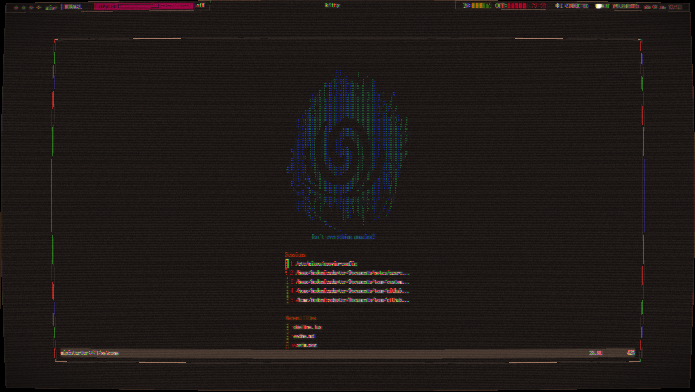
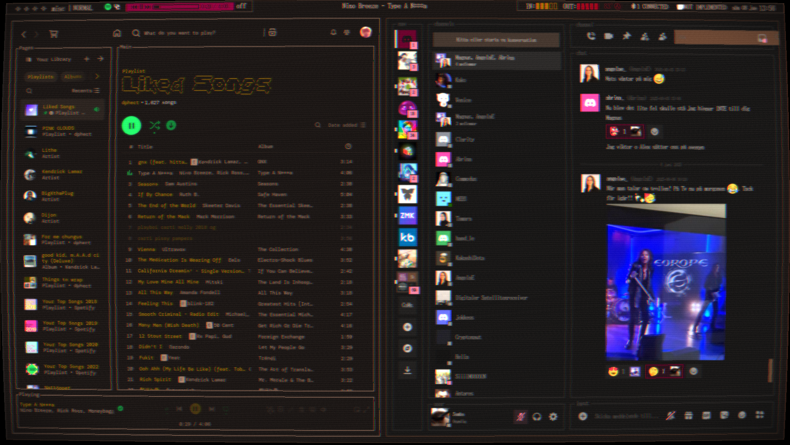
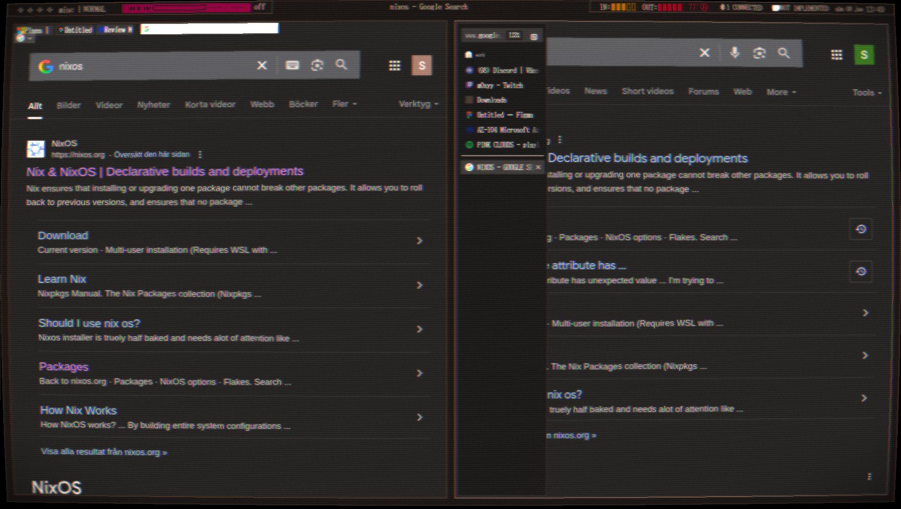
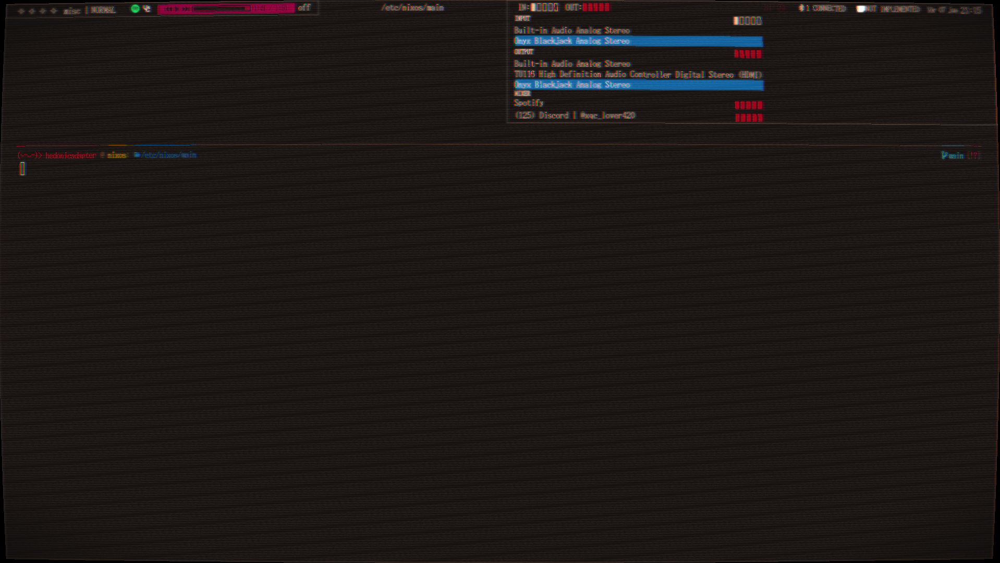

Goals:
1. Experimentation
1. Usability
1. Aesthetics
1. Novelty

## Features 
### Performance and usability
- Nix-Darwin and NixOS in one config
+ CachyOS kernel
+ Undervolted
+ Automatic monitor brightness and tint depending on time of day (not for sleep neglectors)
+ Centralized color palette (change color table in flake -> change everywhere)
+ Speed read selection with keybind

### Aesthetics
Retro and anti-minimalist without being cluttered
- Global Base-16 colors injected into shells, neovim, and electron apps
+ ~~Transparent, blurry, and grainy~~ retro everything, get used to it or disable it
+ Extremely minimal space saving firefox theme forked from Firefox Alpha
+ Auto-picks wallpapers from a folder based on its brightness and time of day (not for sleep neglectors)
- Sets brightness and hue based on time of day and season (not for sleep neglectors)
+ authentic font from [The Ultimate Oldschool PC Font Pack](int10h.org)
+ kaomojis (~‾⌣‾)> 

## Todo
- [ ] nix search, google, protondb, nixos options, and home manager options tofi
- [ ] icons and cursor
- [ ] System-wide font selection
- [ ] Hyprland workspace session manager(?)
- [ ] Change light/dark mode depending on time of day
- [ ] nix-darwin feature parity
- [ ] slightly less extreme CRT effect
- [ ] Moar kaomojis!! <(˶˃⤙˂˶)> 

## Credits
 - (https://github.com/hyprwm/Hyprland/issues/1140#issuecomment-1335128437)[Blue light shaders from MahouShoujoMivutilde]
